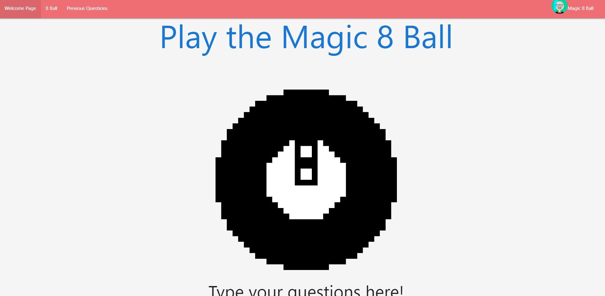

# Project 1: Ask the Magic 8 Ball

## Description
For our project, we hav decided to create an application - The Magic 8 Ball. The Magic 8 Ball is an oversized sphere that is used for fortune telling or when one is seeking for an advice for their question(s). The Magic 8 Ball provides the users with answers to the question that the user asks where the answers are pulled from the following answer categories: affirmative answers, negative answers, and neutral answers. The application will run in the browser and feature dynamically updated HTML and CSS powered by variety of JavaScript APIs, CSS APIs, Bootstrap, and jQuery. 

## User Story
AS AN player
I WANT to view my avatar and name displayed when I enter my name on the login page.
SO THAT I can see answers to my previously asked questions.
I WANT to see answers to questions that I ask.
SO THAT I can decide whether or not to perform an action to the questions that I ask.

## Steps taken to build Magic 8 Ball Application
* Create a repository for the project and invite group members so that we can all work on it.
* Communicate with team members and decide what application we would like to build.
* Create different branches so that we do not interfere with different people's process/codes.
* Find appropriate APIs that can be used for the project.
    * Example I: Avatar API; this allows users to have their own avatar based on their name that they put in the login page.
    * Example II: The Magic 8 Ball API; this allows the Magic 8 Ball to return variety answers from the answer pool.
    * Example III: jQuery (Tooltip), Materialize and Google APIs (CSS Styling), Bootstrap, and etc.
* Perform stand-ups every meetings to go over what we will achieve for the day and the issues that we had on the previous meetings.
* Create login and game HTML. 
* Style the HTML page using CSS APIs.
* Create JavaScript(s) to create more dynamic and interactive application.
* Comment as we write down the lines in our codes.
* Commit and Push as we make changes. Make sure to write descriptive and informative comments!
* Gather all files, then commit, push, and merge all files to dev branch.
* Perform a final check of the application and deploy the application to live URL.

## Criterias for the Magic 8 Ball
* If I visit the application. Then I can input a question to receive an answer.
* If I want to make my own avatar. Then I put my name in the input box; the avatar API will return unique avatar image based on the name I put.
* If I insert a question and press "Enter". Then the 8 Ball will reply to the question.
* If I press "Previous Qeestions" button. Then it will allow me to view all previously asked questions.

## Project Requirements
* Must use at least two server-side APIs.
* Must use client-side storage to store persistent data.
* Must have a polished UI.
* Must meet good quality coding standards (indentation, scoping, naming, etc.)
* Must NOT use alerts, confirms, or prompts.
* Must be deployed to GitHub pages.
* Must be interactive (i.e: accept and respond to user input).

## Screenshot of the Application and Link to the Deployed Application
* Login Page
* Game Page

## Video Demo of Magic 8 Ball Application
* [Video Demo Link](https://user-images.githubusercontent.com/106945679/183773262-e9ab76a4-121e-4ef6-8c20-6892d4deac91.mp4)

## Challenging Moments and Final Thoughts!
Although this project was entertaining and helpful towards all of our careers, but we went through couple of challenging moments during the duration of making the Magic 8 Ball Application. 
For instance, we fairly came up early with what application we would want make for our project; however, it took us quite a bit to determine features and appearance of our application, such as functions, user-friendly design, easy navigation, and etc. We overcame the issue by brainstorming with the project members, creating wireframe of the application, determining user story of the application, and researching and finding appropriate APIs for the project.    

Another issue that we came along was when we tried to merge different branches that we were working on to 'dev' branch. For some reason merging our branches into one branch did not work as smooth as we thought it would be. The major issue that we had was that everyone tried to merge their branches all at once which created merge conflicts. This issue was easily resolved by merging one branch at a time; for instance, we merged our HTML files so that we have actual structure for the web page, then merged CSS files and JavaScript files to add styles and functionalities.

The last issue that we think we had while creating the application was rather simple, which was naming variables, classes, ids, and etc. with correct names. We thought this would consume the longest time; however, it was not as time consuming as we thought it would be. All we had to do was discuss with each other and determine the correct names. Even if we could not figure it out, we could always use DevTools to identify why the application did not work.

We do not believe that we encountered any issues regarding meeting deadlines, failure to meet daily project goals, or inresponsibility towards the project; everyone successfully met the deadline, as well as being responsible to meet daily project goals that were discussed during the stand-ups, and we all worked together and assisted one another whenever we were stuck at certain points. 

## Contributors!
* Jose Otero
* Michael Diaz Dominguez 
* Harvey Lee
* Matteo Ramazzini
* Rowen Schroeder